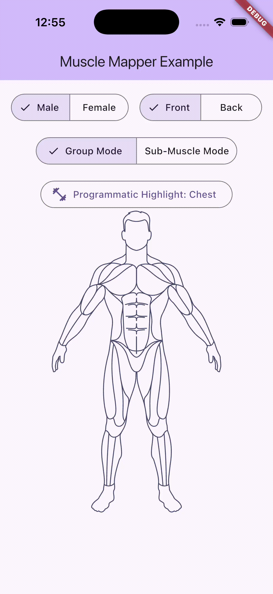

# 🧍 Muscle Mapper



[](https://pub.dev/packages/muscle_mapper/score)
[](https://pub.dev/packages/muscle_mapper)
[](https://pub.dev/packages/muscle_mapper)
[](https://pub.dev/packages/muscle_mapper)
[](https://opensource.org/licenses/MIT)

A pure Dart/Flutter UI package providing an interactive 2D human anatomy model with muscle highlighting, tap detection, and multi-select support.

`muscle_mapper` is built on a **BYOA (Bring Your Own Asset)** architecture — you supply 4 SVG files structured with `<g id="...">` groups, and the package handles all the interactive highlighting, hit-testing, and XML parsing under the hood.

---

## Features

- **Interactive Tap Detection:** Tap on any muscle to trigger custom callbacks or toggle highlighting.
- **Pixel-Perfect Hit Testing:** Hybrid architecture — `flutter_svg` renders the visuals while `path_drawing` parses invisible Flutter `Path` objects for mathematically precise tap detection with zero overlap bugs.
- **Multi-Select Support:** Pass a `Set<Muscle>` to highlight multiple muscles simultaneously.
- **3-Tier Hierarchy:** Interact at the Sub-Muscle, MuscleGroup, or MajorMuscleGroup level.
- **Programmatic Highlighting:** Control selections entirely from code — no user tap needed.
- **Dynamic Color Theming:** Set any `highlightColor` and `baseColor` per widget instance.
- **Smooth Animations:** Fade transitions when muscles activate or deactivate.
- **Dual Bundled Assets:** Ships out of the box with two completely different bundled asset styles (`minimal` and `advanced`).
- **BYOA Architecture:** Load SVGs from assets, network, or any source via a simple `AnatomyAssetProvider` interface.
- **4-View Support:** Male Front, Male Back, Female Front, Female Back — all from a single widget.

---

## 🎯 Perfect For

- 🏋️ **Fitness & Workout Apps** — Show which muscles a workout targets and highlight active muscle groups.
- 🩺 **Physical Therapy Apps** — Track injury sites and recovery progress interactively.
- 📚 **Medical Education** — Provide an interactive anatomy explorer for students.
- 🧘 **Yoga & Stretching Apps** — Visualize stretch zones on the human body.
- 📊 **Training Log Apps** — Use heatmaps to show volume per muscle group over time.

---

## 🏆 Why Muscle Mapper? (vs. Alternatives)

| Feature | `muscle_mapper` | Others (`flutter_body_part_selector` etc) |
|---|---|---|
| **Architecture** | **BYOA** (Bring Your Own Asset) | Hardcoded package assets |
| **Selection Precision** | **100% pixel-perfect math** | Box bounding / overlaps possible |
| **Female Anatomy** | **Yes** (Built-in) | No |
| **Granularity** | **3-Tier** (Sub-muscle, Group, Major) | Flat list |
| **Heatmap Support** | **Yes** (Opacity + Custom Colors) | No |
| **Asset Styles** | **Minimal & Advanced** included | Basic only |

---

## Getting Started

```bash
flutter pub add muscle_mapper
```

Or add manually to your `pubspec.yaml`:

```yaml
dependencies:
  muscle_mapper: ^1.2.0
```

Then run:
```bash
flutter pub get
```

---

## API Reference

### `MuscleMapper` Widget Parameters

| Parameter | Type | Required | Description |
|---|---|---|---|
| `gender` | `AnatomyGender` | ✅ | The gender of the anatomy model (`male` or `female`). |
| `view` | `AnatomyView` | ✅ | The view direction (`front` or `back`). |
| `assetProvider` | `AnatomyAssetProvider` | ✅ | The provider that loads and renders the SVG files. Use `DefaultAnatomyProvider(style: AnatomyStyle.minimal)` or `AnatomyStyle.advanced`. |
| `activeMuscles` | `Set<Muscle>` | ✅ | The set of muscles that are currently highlighted. |
| `muscleIntensities` | `Map<Muscle, double>?` | ❌ | Per-muscle opacity (0.0–1.0) for heatmap rendering. Use `MuscleIntensity.high.value` etc. for convenience. |
| `muscleColors` | `Map<Muscle, Color>?` | ❌ | Per-muscle highlight color, overrides the global `highlightColor`. Use `MajorMuscleGroup.defaultColor` for harmonious palettes. |
| `onMuscleTapped` | `void Function(Muscle)?` | ❌ | Callback fired when the user taps a muscle region. |
| `onMuscleDoubleTapped` | `void Function(Muscle)?` | ❌ | Callback fired when the user double-taps a muscle region. |
| `highlightColor` | `Color` | ❌ | The color used to tint highlighted muscles. Defaults to `Colors.red`. |
| `baseColor` | `Color?` | ❌ | The color used for the base silhouette. Defaults to `Colors.grey`. |
| `animationDuration` | `Duration` | ❌ | Duration of the highlight fade animation. Defaults to `300ms`. |
| `animationCurve` | `Curve` | ❌ | Curve of the highlight fade animation. Defaults to `Curves.easeInOut`. |
| `loadingWidget` | `Widget?` | ❌ | Custom widget shown while the SVG is loading. Defaults to `CircularProgressIndicator`. |
| `onError` | `void Function(Object)?` | ❌ | Callback fired if the SVG fails to load or parse. Use this for graceful error handling. |
| `verbose` | `bool` | ❌ | When `true`, prints parsing and hit-test logs to the console. Defaults to `false`. |

### Static Methods

| Method | Description |
|---|---|
| `MuscleMapper.clearCache()` | Clears the global SVG parse cache. Call this when using a network-based `AnatomyAssetProvider` whose remote content has changed. |

---

## Anatomy Styles (Minimal vs. Advanced)

The `DefaultAnatomyProvider` comes with two bundled SVG styles:
1. `AnatomyStyle.minimal` (Default): A fast, lightweight, and modern SVG ideal for fitness apps.
2. `AnatomyStyle.advanced`: A highly detailed, medically accurate SVG perfect for clinical or educational apps.

**Important Note on Advanced Assets**:
Currently, the `advanced` style only provides **male** anatomy assets. If you request `AnatomyGender.female` while using `AnatomyStyle.advanced`, the package will safely fall back to displaying the male advanced model to prevent crashing.

### Attribution (Advanced SVGs)
The `advanced` SVGs are generously provided under the CC BY 4.0 license by **Ryan Graves**.
If you use `AnatomyStyle.advanced` in your public application, you must provide attribution to Ryan Graves. See the [CREDITS.md](CREDITS.md) file for full attribution details.

---

## How to Provide Custom SVGs

The package requires 4 whole-body SVG files. Each file must use `<g id="...">` groups so the package can extract the base body layer and individual muscle layers dynamically.

### 1. File Names

Place your SVG files wherever your `AnatomyAssetProvider` points to. The bundled `DefaultAnatomyProvider` loads them from `packages/muscle_mapper/lib/src/assets/minimal/` or `assets/advanced/` depending on the `AnatomyStyle`:

| File | Description |
|---|---|
| `male_front_muscle_anatomy.svg` | Male, anterior view |
| `male_back_muscle_anatomy.svg` | Male, posterior view |
| `female_front_muscles_anatomy.svg` | Female, anterior view |
| `female_back_muscles_anatomy.svg` | Female, posterior view |

### 2. Required SVG Group IDs

All 4 SVGs must use `<g id="...">` groups matching the IDs below. The parser searches for each ID in order and uses the first match found — so you only need to include the groups relevant to each view.

**Base layer (required in all SVGs):**
```xml
<g id="body"> ... </g>
```

**Front-view muscles:**

| Muscle | Group IDs |
|---|---|
| Chest | `upper-pectoralis`, `mid-lower-pectoralis` |
| Abs | `upper-abdominals`, `lower-abdominals` |
| Biceps | `long-head-bicep`, `short-head-bicep` |
| Forearms | `wrist-flexors`, `wrist-extensors` |
| Front Deltoids | `anterior-deltoid`, `lateral-deltoid` |
| Obliques | `obliques` |
| Quads | `outer-quadricep`, `rectus-femoris`, `inner-quadricep` |
| Tibialis | `tibialis` |

**Back-view muscles:**

| Muscle | Group IDs |
|---|---|
| Lats | `lats` |
| Lower Back | `lowerback` |
| Glutes | `gluteus-maximus`, `gluteus-medius` |
| Hamstrings | `lateral-hamstrings`, `medial-hamstrings` |
| Triceps | `long-head-triceps`, `lateral-head-triceps`, `medial-head-triceps` |
| Rear Deltoids | `posterior-deltoid` |
| Upper Back | `traps-middle`, `lower-trapezius` |

**Shared (front & back):**

| Muscle | Group IDs |
|---|---|
| Traps | `upper-trapezius` |
| Calves | `gastrocnemius`, `soleus` |
| Hands | `hands` |
| Neck | `neck` |

> **Tip:** Each muscle can have multiple group IDs. The parser finds each group and combines all their `<path>` elements for both rendering and hit-testing.

*Example:*
```xml
<g id="upper-pectoralis">
  <path d="M..." fill="currentColor" />
</g>
<g id="mid-lower-pectoralis">
  <path d="M..." fill="currentColor" />
</g>
```

---

## Interaction & Selection Hierarchy

The package uses a **3-tier hierarchy** to give you maximum flexibility. The widget detects taps at the most granular level, but you can easily convert that into a group selection in your callback!

1. **`Muscle` (Sub-Muscle):** 35 items matching the SVG exactly (e.g., `upperPectoralis`, `shortHeadBicep`)
2. **`MuscleGroup`:** 20 items grouping related sub-muscles (e.g., `chest`, `biceps`, `quads`)
3. **`MajorMuscleGroup`:** 7 major body regions (e.g., `arms`, `legs`, `core`)

### Example: Toggling Interaction Modes

You can dynamically switch between highlighting just the specific piece tapped vs the whole muscle group:

```dart
void _onTap(Muscle tappedMuscle) {
  setState(() {
    if (isSubMuscleMode) {
      // Sub-Muscle Mode: Highlight ONLY the exact piece you tapped
      _activeMuscles.add(tappedMuscle);
    } else {
      // Group Mode: Highlight the entire major group (e.g. the whole chest)
      _activeMuscles.addAll(tappedMuscle.group.majorGroup.subMuscles);
    }
  });
}
```

---

## Major Muscle Groups

Use `MajorMuscleGroup` to highlight an entire section of the body at once.

Available groups: `arms`, `legs`, `core`, `chest`, `back`, `shoulders`, `headAndNeck`.

```dart
// Highlight the full arm group (biceps, triceps, forearms, hands)
MuscleMapper(
  activeMuscles: MajorMuscleGroup.arms.subMuscles,
)

// Highlight multiple groups simultaneously
MuscleMapper(
  activeMuscles: {
    ...MajorMuscleGroup.arms.subMuscles,
    ...MajorMuscleGroup.legs.subMuscles,
  },
)

// Find which major group a sub-muscle belongs to
final majorGroup = Muscle.longHeadBicep.group.majorGroup; // → MajorMuscleGroup.arms
```
---

## Programmatic Highlighting

Because `MuscleMapper` is completely declarative, you have 100% control over what is highlighted from outside the widget. Simply modify your `Set<Muscle>` and call `setState()`.

```dart
ElevatedButton(
  onPressed: () {
    setState(() {
      // Instantly highlight the entire chest from code!
      _activeMuscles.addAll(MuscleGroup.chest.subMuscles);
    });
  },
  child: const Text('Workout of the Day: Chest'),
)
```

---

## Intensity Heatmaps

`MuscleMapper` natively supports rendering exercise intensities as heatmaps! You can specify distinct colors for different muscles using `muscleColors`, and control their opacity using `muscleIntensities`. 

You can pass exact mathematical values (0.0 to 1.0) or use the built-in `MuscleIntensity` enum. Additionally, you can use the `MajorMuscleGroup.defaultColor` extension to get harmonious default colors for different body parts (e.g., Arms = Blue, Chest = Red).

```dart
MuscleMapper(
  assetProvider: const DefaultAnatomyProvider(),
  // 1. Pass explicit intensity values (opacity)
  muscleIntensities: {
    Muscle.longHeadBicep: MuscleIntensity.high.value,    // 1.0 opacity
    Muscle.shortHeadBicep: MuscleIntensity.medium.value, // 0.66 opacity
    Muscle.upperPectoralis: 0.85,                        // Or use exact custom math!
  },
  // 2. Pass explicit highlight colors
  muscleColors: {
    Muscle.longHeadBicep: MajorMuscleGroup.arms.defaultColor,
    Muscle.shortHeadBicep: MajorMuscleGroup.arms.defaultColor,
    Muscle.upperPectoralis: MajorMuscleGroup.chest.defaultColor,
  },
)
```

---

## Usage

```dart
import 'package:flutter/material.dart';
import 'package:muscle_mapper/muscle_mapper.dart';

class AnatomyScreen extends StatefulWidget {
  @override
  _AnatomyScreenState createState() => _AnatomyScreenState();
}

class _AnatomyScreenState extends State<AnatomyScreen> {
  final Set<Muscle> _activeMuscles = {};

  void _onTap(Muscle muscle) {
    setState(() {
      if (_activeMuscles.contains(muscle)) {
        _activeMuscles.remove(muscle);
      } else {
        _activeMuscles.add(muscle);
      }
    });
  }

  @override
  Widget build(BuildContext context) {
    return Scaffold(
      body: Center(
        child: SizedBox(
          height: 500,
          child: MuscleMapper(
            gender: AnatomyGender.male,
            view: AnatomyView.front,
            assetProvider: const DefaultAnatomyProvider(style: AnatomyStyle.advanced),
            activeMuscles: _activeMuscles,
            onMuscleTapped: _onTap,
            highlightColor: Colors.redAccent,
          ),
        ),
      ),
    );
  }
}
```

---

## Custom Asset Providers

Implement `AnatomyAssetProvider` to load SVGs from any source (network, database, etc.):

```dart
class MyNetworkProvider implements AnatomyAssetProvider {
  @override
  Future<String> getAnatomySvgRawString(AnatomyGender gender, AnatomyView view) async {
    final url = 'https://myapi.com/anatomy/${gender.name}_${view.name}.svg';
    final response = await http.get(Uri.parse(url));
    return response.body;
  }

  @override
  Widget buildSvgWidget(String svgString) {
    return SvgPicture.string(svgString, fit: BoxFit.contain);
  }
}
```

---

## Architecture Notes

The widget uses a **hybrid rendering + hit-testing** strategy:

1. **On load:** The raw SVG is parsed as XML. For each muscle, the parser searches for `<g id="...">` elements matching the muscle's ID list. All matched `<path d="...">` data is extracted and combined into a Flutter `Path` object (for hit-testing) and a standalone SVG string (for rendering).
2. **On render:** The base body is drawn with `flutter_svg`. Each muscle highlight layer is drawn on top with `AnimatedOpacity` + `ColorFiltered`, all wrapped in `IgnorePointer`.
3. **On tap:** A single `GestureDetector` at the `Stack` level maps the screen tap coordinate into the SVG's `viewBox` coordinate space (using `BoxFit.contain` math), then uses `Path.contains()` to find the tapped muscle. This eliminates all overlap and tap-stealing issues.


---

## License

MIT License. See [LICENSE](LICENSE) for details.
